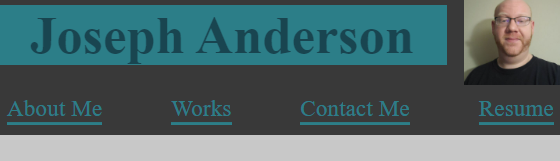
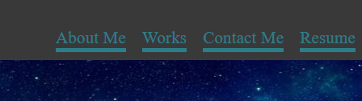
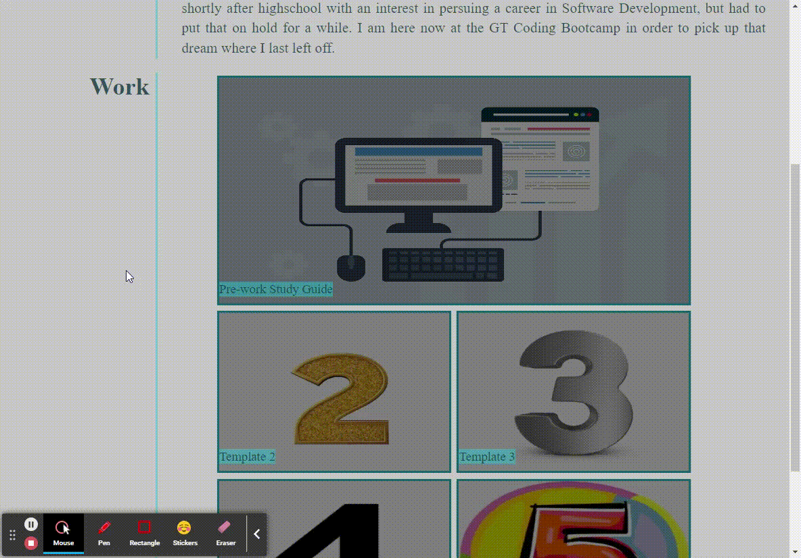

# Portfolio
## Description
 
 This project was to create a Portfolio that I can add to in order to showcase my work to anyone who
 would be interested in viewing it. In the making of the portfolio we adhered to a mobile first design method.
## Installation

N/A

## Usage

Follow this [link](https://josephfanderson.github.io/Portfolio) to be taken to the webpage. Once there you can use the navigation buttons to jump to your desired location.

 
Mobile version

Desktop Version 

In the works section, clicking on an image will link you to the deployed webpage application. Currently this only works for the Pre-work Study Guide due to only having the 1 deployed application. Will update as I get more. 

 

The Contact Me section provides links to various methods to contact me. Email, Github, and Phone.
## License

N/A
